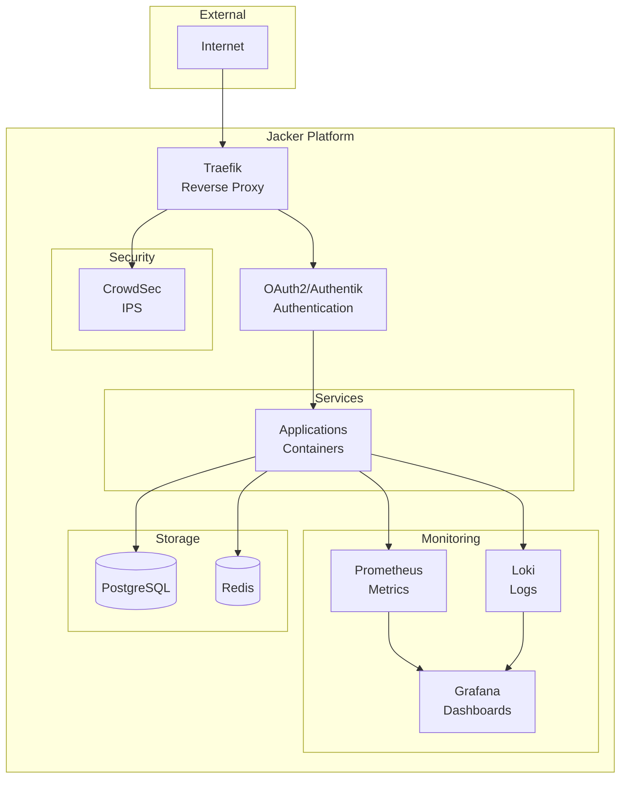

# Jacker

   

A production-ready Docker platform with integrated security, monitoring, and service orchestration.

## What is Jacker?

Jacker provides a complete home server management platform built on Docker, combining **Traefik v3** reverse proxy, **CrowdSec** security, **OAuth/Authentik** authentication, and comprehensive monitoring into a single, cohesive system. With 26 integrated services and modular architecture, Jacker makes self-hosting powerful applications simple and secure.

## Project Status

**Latest Release:** v1.0.0 - Production Ready (2025-10-14)

The Jacker platform has undergone comprehensive improvements across security, monitoring, and code quality:

- **Phase 1 (Security Hardening):** Fixed 3 CRITICAL security vulnerabilities in OAuth configuration and Traefik setup
- **Phase 2 (Monitoring Expansion):** Increased monitoring coverage from 40% to 96% (25 of 26 services monitored)
- **Phase 3 (Code Quality):** Hardened all shell scripts, added network IPAM configurations, and created pre-deployment validation

The platform is now production-ready with enterprise-grade security, comprehensive observability, and robust deployment processes.

### Key Features

- 🔀 **Traefik v3** - Automatic SSL, dynamic routing, HTTP/3 support
- 🛡️ **CrowdSec IPS/IDS** - Collaborative threat protection with real-time IP blocking
- 🔐 **Dual Authentication** - Hardened Google OAuth or self-hosted Authentik with MFA/SSO
- 📊 **Complete Monitoring** - Prometheus, Grafana, Loki, Promtail, Alertmanager (96% service coverage)
- 🐳 **26 Integrated Services** - Ready-to-use platform components
- 📦 **Stack Management** - Install additional applications with one command
- 🚀 **Quick Setup** - Get running in under 5 minutes with DNS validation
- 🔧 **Modular Architecture** - Easy to customize and extend
- ✅ **Pre-Deployment Validation** - Automated checks prevent deployment failures
- 🔍 **Blackbox Monitoring** - HTTPS endpoint and SSL certificate expiry monitoring
- 🌐 **Network IPAM** - Predictable IP allocation with defined subnets

## Architecture



## Prerequisites

Before installing Jacker, ensure your system meets these requirements:

### System Requirements

- **Operating System**: Linux (Ubuntu 20.04+, Debian 11+, or similar)
- **Docker**: Version 24.0 or higher
- **Docker Compose**: Version 2.20 or higher
- **Memory**: Minimum 2GB RAM (4GB+ recommended for production)
- **Disk Space**: Minimum 20GB free space (50GB+ recommended)
- **CPU**: 2+ cores recommended

### Access Requirements

- **sudo/root access**: Required for:
  - Setting directory permissions during initial setup
  - Installing Docker (if not already installed)
  - Configuring system networking (optional)

### Network Requirements

- **Domain Name**: A registered domain with DNS access
- **DNS Configuration**: Ability to create A records pointing to your server
- **Open Ports**:
  - Port 80 (HTTP) - for Let's Encrypt validation
  - Port 443 (HTTPS) - for secure web access
  - These ports must not be used by other services (Apache, Nginx, etc.)

### DNS Setup (Required Before Installation)

Configure these DNS records before running the installer:

```
yourdomain.com              A    YOUR_SERVER_IP
*.yourdomain.com            A    YOUR_SERVER_IP
```

Or individual records for each service:

```
traefik.yourdomain.com      A    YOUR_SERVER_IP
grafana.yourdomain.com      A    YOUR_SERVER_IP
portainer.yourdomain.com    A    YOUR_SERVER_IP
(etc.)
```

DNS propagation can take 5-60 minutes. Verify with:
```bash
nslookup traefik.yourdomain.com
```

### Optional Requirements

- **OAuth Provider** (Google, GitHub, etc.) - For authentication
- **SMTP Server** - For email alerts
- **Telegram/Slack** - For chat notifications

### Checking Prerequisites

Run the validation script to check your system:

```bash
./scripts/validate.sh
```

This will verify:
- Docker and Docker Compose versions
- Available disk space and memory
- Port availability
- DNS configuration (if domain is set)

## Quick Start

```bash
# Clone the repository
git clone https://github.com/jacar-javi/jacker.git
cd jacker

# Validate prerequisites
./scripts/validate.sh

# Run installer (choose Quick or Advanced setup)
./jacker init

# Check health
./jacker health

# Access your services
# https://yourdomain.com - Homepage dashboard
# https://traefik.yourdomain.com - Traefik dashboard
# https://grafana.yourdomain.com - Grafana monitoring
```

That's it! Your Jacker platform is now running with all 26 services ready to use with valid SSL certificates.

### Setup Modes

**Quick Setup** (< 1 minute)
- Minimal prompts, auto-detection of system settings
- Perfect for testing or development
- Can reconfigure OAuth/SSL later with `./jacker config oauth` and `./jacker config ssl`

**Advanced Setup** (Full customization)
- Complete control over all settings
- Production-ready configuration
- OAuth credentials, SSL certificates, and advanced options

## Included Services

Jacker comes with **26 integrated services** organized into functional categories:

### Core Infrastructure
- **Traefik v3** - Reverse proxy with automatic SSL (Let's Encrypt)
- **Socket Proxy** - Secure Docker socket access
- **PostgreSQL** - Relational database for services
- **Redis** - In-memory cache for authentication sessions

### Security & Authentication
- **OAuth2-Proxy** - Hardened Google OAuth authentication (default)
- **Authentik** - Self-hosted identity provider (optional, supports MFA/SSO/SAML)
- **CrowdSec** - Collaborative IPS/IDS with community threat intelligence
- **Traefik Bouncer** - Real-time IP blocking integrated with CrowdSec

### Monitoring & Observability (96% Coverage)
- **Prometheus** - Metrics collection and time-series database
- **Grafana** - Visualization dashboards for metrics and logs
- **Loki** - Log aggregation system
- **Promtail** - Log collection agent
- **Alertmanager** - Alert routing and notifications (HA setup with secondary)
- **Node Exporter** - System metrics (CPU, memory, disk, network)
- **Blackbox Exporter** - HTTPS endpoint and SSL certificate monitoring (NEW)
- **cAdvisor** - Per-container resource usage metrics (NEW)
- **Jaeger** - Distributed tracing for microservices
- **Postgres Exporter** - Database metrics
- **Redis Exporter** - Cache metrics
- **Pushgateway** - Metrics for batch jobs

### Management Tools
- **Homepage** - Unified dashboard with auto-discovery and widgets
- **Portainer** - Web UI for Docker management
- **VS Code Server** - Browser-based IDE for remote development
- **Redis Commander** - Web UI for Redis management

📖 **Detailed service documentation:** [compose/README.md](compose/README.md)

## Additional Applications

Install additional stacks with the integrated stack manager:

```bash
# List available stacks
./jacker stacks list

# Search for specific applications
./jacker stacks search wordpress

# Install a stack
./jacker stacks install wordpress

# List installed stacks
./jacker stacks installed
```

## Documentation

Complete documentation is available at **[jacker.jacar.es](https://jacker.jacar.es)**

### 📚 Quick Links

#### Getting Started
- **[Installation Guide](https://jacker.jacar.es/installation/)** - System requirements and setup
- **[Quick Start](https://jacker.jacar.es/installation/quick-start/)** - Get running in 5 minutes
- **[Configuration](https://jacker.jacar.es/installation/configuration/)** - Environment variables and settings

#### Repository Documentation
- **[compose/README.md](compose/README.md)** - All 21 services documented with URLs, images, and descriptions
- **[assets/README.md](assets/README.md)** - All scripts, libraries, and maintenance tools
- **[config/README.md](config/README.md)** - Configuration management and templates
- **[data/README.md](data/README.md)** - Runtime data, permissions, and storage
- **[secrets/README.md](secrets/README.md)** - Secrets management and security

#### Operations
- **[User Guide](https://jacker.jacar.es/guide/)** - Daily operations and management
- **[Security](https://jacker.jacar.es/security/)** - Security features and best practices
- **[Monitoring](https://jacker.jacar.es/monitoring/)** - Metrics, logs, and alerting
- **[Troubleshooting](docs/TROUBLESHOOTING.md)** - Common issues and solutions (especially first-install issues)
- **[Directory Permissions](docs/DIRECTORY_PERMISSIONS.md)** - Permission requirements and fixes

## Management

```bash
# Basic commands
./jacker start          # Start all services
./jacker stop           # Stop all services
./jacker restart        # Restart all services
./jacker status         # Show service status
./jacker logs           # View all logs

# Validation and health
./validate.sh           # Pre-deployment validation (12 checks)
./jacker health         # Check service health
./jacker config validate # Validate configuration files

# Updates and maintenance
./jacker update         # Update all images
./jacker backup         # Create backup
./jacker restore        # Restore from backup

# View all available commands
./jacker help
```

## Support

- **📖 Documentation**: [jacker.jacar.es](https://jacker.jacar.es)
- **🐛 Issues**: [GitHub Issues](https://github.com/jacar-javi/jacker/issues)
- **💬 Discussions**: [GitHub Discussions](https://github.com/jacar-javi/jacker/discussions)
- **📧 Contact**: [support@jacker.jacar.es](mailto:support@jacker.jacar.es)

## Contributing

Contributions are welcome! Please see our [Contributing Guide](https://github.com/jacar-javi/jacker/blob/main/CONTRIBUTING.md) for details.

## License

This project is licensed under the terms specified in [LICENSE](LICENSE).

---

**Jacker** = **ja**car + do**cker** - Your complete Docker platform solution.
