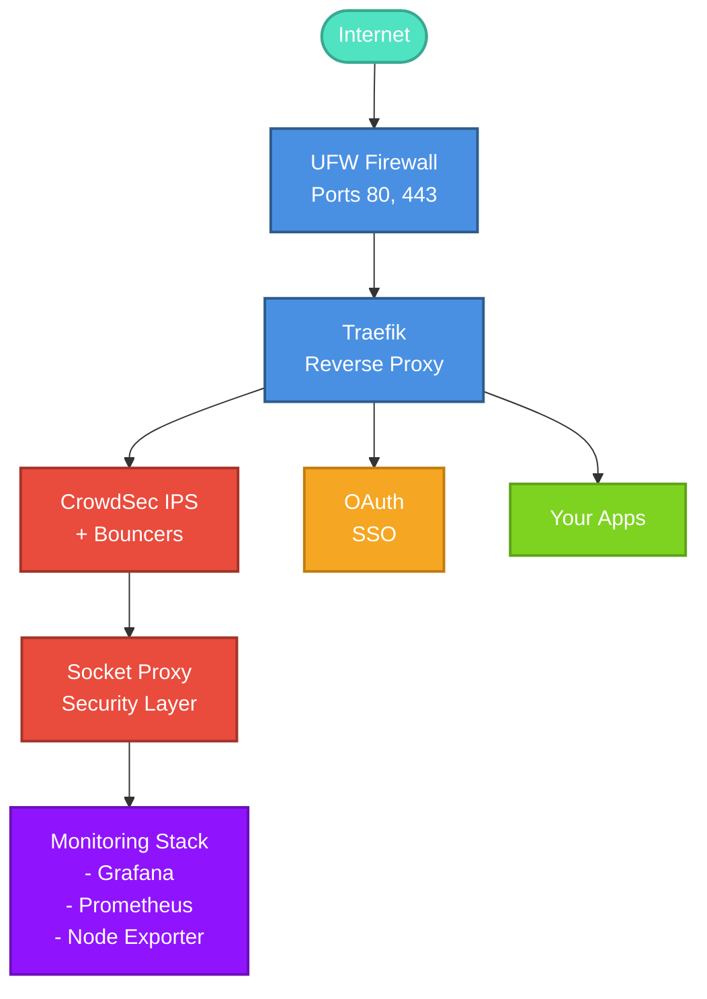

# Jacker

**Jacker** = jacar + docker

A production-ready Docker stack combining **Traefik**, **CrowdSec**, and **Google OAuth** for secure, monitored hosting with Single Sign-On (SSO) access to management tools.

Jacker provides a solid, security-hardened foundation for hosting Docker-based services, establishing best practices and standards necessary for any production system.

---

## Features

- **Reverse Proxy**: Traefik with automatic SSL/TLS certificates (Let's Encrypt)
- **Security**: CrowdSec IPS with Traefik and iptables bouncers
- **Authentication**: Google OAuth2 SSO or self-hosted Authentik for unified access control
- **Monitoring**: Grafana + Prometheus + Node Exporter stack
- **Management**: Portainer for Docker management, Homepage dashboard
- **Networking**: Isolated Docker networks with socket proxy
- **Firewall**: UFW configuration with automated rules
- **Health Checks**: Built-in health monitoring and validation tools
- **Backup**: Automated backup and restore utilities
- **Centralized Logging**: Loki + Promtail for log aggregation
- **Advanced Alerting**: Alertmanager with Email + Telegram notifications
- **Stack Management**: Browse, install, and manage Docker stacks
- **Performance**: Redis cache + PostgreSQL tuning for 3x throughput
- **Multi-Architecture**: Full x86_64 and ARM64 support

---

## 🖥️ Platform Compatibility

Jacker runs on all major Linux distributions with both x86_64 and ARM64 support:

| Platform | x86_64 | ARM64 | Status | Notes |
|----------|--------|-------|--------|-------|
| **Ubuntu 24.04 LTS** | ✅ | ✅ | Recommended | Best choice |
| **Ubuntu 22.04 LTS** | ✅ | ✅ | Recommended | Fully tested |
| **Debian 12 (Bookworm)** | ✅ | ✅ | Recommended | Stable |
| **Debian 11 (Bullseye)** | ✅ | ✅ | Supported | |
| **Rocky Linux 9** | ✅ | ✅ | Supported | RHEL-compatible |
| **AlmaLinux 9** | ✅ | ✅ | Supported | RHEL-compatible |
| **Raspberry Pi OS** | ❌ | ✅ | Supported | 8GB+ RAM, USB SSD |
| **macOS (Docker Desktop)** | ✅ | ✅ | Development | Not for production |
| **Windows (WSL2)** | ✅ | ⚠️ | Development | Not for production |

### Hardware Requirements

| Component | Minimum | Recommended | Optimal |
|-----------|---------|-------------|---------|
| **CPU** | 2 cores | 4 cores | 8+ cores |
| **RAM** | 2GB | 4GB | 8-16GB |
| **Storage** | 20GB | 50GB SSD | 100GB+ NVMe |
| **Network** | 100 Mbps | 1 Gbps | 10 Gbps |

### Cloud Platform Support

| Provider | x86_64 | ARM64 | Recommended Instance |
|----------|--------|-------|---------------------|
| **Oracle Cloud** | ✅ | ✅ | VM.Standard.A1.Flex (ARM, Free Tier!) |
| **AWS** | ✅ | ✅ | t3.large / t4g.large (Graviton) |
| **Google Cloud** | ✅ | ✅ | t2a-standard-2 (Tau ARM) |
| **Azure** | ✅ | ⚠️ | Standard_B2s |
| **Hetzner** | ✅ | ✅ | CAX11 (ARM) |

**📋 See [COMPATIBILITY.md](https://github.com/jacar-javi/jacker-docs/blob/main/docs/reference/compatibility.md) for detailed platform information, benchmarks, and optimization guides.**

---

## Architecture



---

## Quick Start

### Prerequisites

- **OS**: Ubuntu 22.04+, Debian 11+, Rocky/AlmaLinux 9 (x86_64 or ARM64)
- **RAM**: Minimum 2GB (4GB+ recommended for all services)
- **Disk**: 20GB+ free space (SSD recommended)
- **Access**: SSH with sudo privileges
- **Domain**: A valid domain name pointing to your server
- **Authentication**: Google OAuth2 credentials ([Setup Guide](https://jacker.jacar.es/first-steps/prepare/#step-2-configure-google-oauth2-service)) or Authentik (self-hosted)

**Note:** See [COMPATIBILITY.md](https://github.com/jacar-javi/jacker-docs/blob/main/docs/reference/compatibility.md) for detailed platform requirements and tested configurations.

### Installation

```bash
# 1. Clone the repository
git clone https://github.com/jacar-javi/jacker.git
cd jacker

# 2. Run the setup script
./setup.sh

# 3. Follow the interactive prompts to configure:
#    - Hostname and domain
#    - Google OAuth credentials
#    - Email for Let's Encrypt
#    - Firewall rules
#    - Authorized users

# 4. Reboot when prompted
# The script will automatically continue after reboot

# 5. Verify installation
./validate.sh
./health-check.sh
```

### Post-Installation

After successful installation, access your services:

- **Traefik Dashboard**: `https://traefik.yourdomain.com`
- **Portainer**: `https://portainer.yourdomain.com`
- **Grafana**: `https://grafana.yourdomain.com`
- **Homepage**: `https://home.yourdomain.com`

All services are protected by Google OAuth SSO.

---

## Management

### Using Make (Recommended)

Jacker includes a comprehensive Makefile for easy management:

```bash
# View all available commands
make help

# Common operations
make start              # Start all services
make stop               # Stop all services
make restart            # Restart all services
make status             # Show service status
make logs               # View all logs

# Health and validation
make health             # Check service health
make health-watch       # Watch health in real-time
make validate           # Validate configuration
make test               # Run automated tests

# Backup and restore
make backup             # Create backup
make restore BACKUP=/path/to/backup

# Service-specific operations
make restart-service SERVICE=traefik
make logs-service SERVICE=traefik
make shell SERVICE=traefik

# CrowdSec management
make crowdsec-decisions
make crowdsec-bouncers
make crowdsec-metrics

# See 'make help' for 40+ available commands
```

### Daily Operations (Manual)

```bash
# Check service health
./health-check.sh

# Watch services in real-time
./health-check.sh --watch

# Validate configuration
./validate.sh

# View logs
docker compose logs -f [service_name]

# Restart a service
docker compose restart [service_name]
```

### Updates

```bash
# Using Make
make update

# Or manually
./update.sh

# This will:
# - Pull latest images
# - Recreate containers
# - Clean up unused images
# - Prompt for reboot
```

### Backup & Restore

```bash
# Create backup using Make
make backup
make backup BACKUP_DIR=/path/to/backup

# Or manually
./backup.sh
./backup.sh /path/to/backup/dir

# Restore from backup
make restore BACKUP=/path/to/backup
# Or manually
./restore.sh /path/to/backup

# Backups include:
# - Configuration files
# - SSL certificates
# - CrowdSec data
# - Service configurations
# - Integrity checksums
```

### Security

```bash
# Using Make
make crowdsec-decisions    # View decisions
make crowdsec-bouncers     # Check bouncers
make crowdsec-metrics      # View metrics
make crowdsec-update       # Update collections
make rotate-secrets        # Rotate all secrets

# Or manually
cscli decisions list
cscli bouncers list
cscli metrics
cscli collections upgrade --all
./assets/rotate-secrets.sh --all
```

### Stack Management

Jacker includes a powerful stack management system for deploying additional services:

```bash
# List available stacks
./jacker-stack list
make stack-list

# Search for stacks
./jacker-stack search wordpress
make stack-search QUERY=media

# Show stack information
./jacker-stack info wordpress
make stack-info STACK=wordpress

# Install a stack
./jacker-stack install wordpress
make stack-install STACK=wordpress

# List installed stacks
./jacker-stack installed
make stack-installed

# Uninstall a stack
./jacker-stack uninstall wordpress
make stack-uninstall STACK=wordpress
```

**Available Stack Categories:**
- 📝 **CMS**: WordPress, Joomla, Ghost
- 🤝 **Collaboration**: Nextcloud, OnlyOffice, Jitsi
- 🎬 **Media**: Plex Media Server stack (Sonarr, Radarr, etc.)
- 🔐 **Security**: Passbolt, Vaultwarden
- 🛠️ **Tools**: IT-Tools, Uptime Kuma
- 🌐 **Networking**: Pi-hole, WireGuard, OpenVPN

**Integrated Repositories:**
- `jacker-stacks` - Curated stacks optimized for Jacker
- `awesome-compose` - Official Docker Compose examples
- `compose-examples` - Community-contributed stacks

See [Stack Management Guide](https://github.com/jacar-javi/jacker-docs/blob/main/docs/guides/stack-management.md) for detailed documentation.

---

## Configuration

### Environment Variables

All configuration is managed through the `.env` file, automatically created during setup:

- `HOSTNAME`: Your server hostname
- `DOMAINNAME`: Your domain (e.g., example.com)
- `OAUTH_CLIENT_ID`: Google OAuth client ID
- `OAUTH_CLIENT_SECRET`: Google OAuth client secret
- `OAUTH_WHITELIST`: Comma-separated authorized emails
- `LETSENCRYPT_EMAIL`: Email for SSL certificate notifications

See `.env.sample` for all available options.

### Adding Services

```bash
# Use the stack creation tool
cd stacks
./newstack.sh myservice

# Or manually create in compose/
# Then add to docker-compose.yml
```

### Firewall Rules

To modify firewall rules, edit `.env`:

```bash
UFW_ALLOW_FROM=10.0.0.0/8,192.168.0.0/16
UFW_ALLOW_PORTS=http,https,8080
UFW_ALLOW_SSH=1.2.3.4,5.6.7.0/24
```

Then re-run: `./assets/03-setup_ufw.sh`

---

## Troubleshooting

### Common Issues

**Services not starting:**
```bash
docker compose ps
docker compose logs [service_name]
./validate.sh
```

**SSL certificates not working:**
```bash
# Check acme.json permissions
ls -la data/traefik/acme.json  # Should be 600

# View Traefik logs
docker compose logs traefik
```

**OAuth not working:**
```bash
# Verify OAuth configuration
cat secrets/traefik_forward_oauth

# Check OAuth container
docker compose logs oauth
```

**CrowdSec issues:**
```bash
# Check bouncer status
cscli bouncers list

# Register bouncers manually
./register_bouncers.sh

# View CrowdSec logs
docker compose logs crowdsec
```

For more detailed troubleshooting, see [Troubleshooting Guide](https://github.com/jacar-javi/jacker-docs/blob/main/docs/guides/troubleshooting.md)

---

## Project Structure

```
jacker/
├── assets/                      # All utility scripts and tools
│   ├── 01-tune_system.sh       # System tuning
│   ├── 02-install_docker.sh    # Docker installation
│   ├── 03-setup_ufw.sh         # Firewall setup
│   ├── 04-install_assets.sh    # Asset installation
│   ├── 05-install_iptables-bouncer.sh
│   ├── setup.sh                 # Main setup script
│   ├── clean.sh                 # Cleanup utility
│   ├── update.sh                # Update utility
│   ├── backup.sh                # Backup utility
│   ├── restore.sh               # Restore utility
│   ├── validate.sh              # Validation tool
│   ├── health-check.sh          # Health monitoring
│   ├── test.sh                  # Automated testing
│   ├── rotate-secrets.sh        # Secrets rotation
│   ├── migrate-crowdsec-plugin.sh # CrowdSec migration
│   ├── jacker-stack             # Stack manager CLI
│   └── templates/               # Configuration templates
├── compose/                     # Docker Compose service files
│   ├── traefik.yml
│   ├── crowdsec.yml
│   ├── oauth.yml
│   ├── loki.yml
│   ├── promtail.yml
│   ├── alertmanager.yml
│   └── ...
├── data/                        # Persistent service data
│   ├── traefik/
│   ├── crowdsec/
│   ├── grafana/
│   ├── prometheus/
│   │   └── alerts/              # Alert rules
│   ├── loki/                    # Log configurations
│   ├── alertmanager/            # Alert routing
│   └── ...
├── stacks/                      # Installed additional stacks
├── jacker-stacks/               # Stack repository (submodule)
├── .jacker/                     # Stack manager config
│   └── repositories.json
├── logs/                        # Application logs
├── secrets/                     # Sensitive configuration
├── jacker-stack -> assets/jacker-stack  # CLI symlink
├── Makefile                     # Make commands (50+)
└── docker-compose.yml           # Main compose file
```

---

## Contributing

Contributions are welcome! Please see [Contributing Guide](https://github.com/jacar-javi/jacker-docs/blob/main/docs/reference/contributing.md) for guidelines.

---

## Security

For security concerns, please review our [Security Policy](https://github.com/jacar-javi/jacker-docs/blob/main/docs/reference/security.md).

---

## Documentation

### Official Documentation Site

📚 **[jacker.jacar.es](https://jacker.jacar.es)** - Complete documentation with search, tutorials, and guides

The documentation is organized into the following sections:

**🚀 First Steps** - Get started with Jacker
- Installation and setup
- System preparation
- Initial configuration

**⚙️ Operations** - Day-to-day management
- [Daily Operations](https://github.com/jacar-javi/jacker-docs/blob/main/docs/operations/daily-operations.md) - Service management, monitoring, backups
- [Migration Guide](https://github.com/jacar-javi/jacker-docs/blob/main/docs/operations/migration.md) - Upgrade paths and component migrations

**📖 Guides** - Feature-specific documentation
- [Stack Management](https://github.com/jacar-javi/jacker-docs/blob/main/docs/guides/stack-management.md) - Browse, install, and manage Docker stacks
- [Authentik Setup](https://github.com/jacar-javi/jacker-docs/blob/main/docs/guides/authentik.md) - Self-hosted identity provider with SSO, MFA, and LDAP
- [Authentik Migration](https://github.com/jacar-javi/jacker-docs/blob/main/docs/guides/authentik-migration.md) - Migrate from Google OAuth to Authentik
- [Logging & Alerting](https://github.com/jacar-javi/jacker-docs/blob/main/docs/guides/logging-alerting.md) - Loki, Promtail, and Alertmanager setup
- [Troubleshooting](https://github.com/jacar-javi/jacker-docs/blob/main/docs/guides/troubleshooting.md) - Common issues and solutions

**🔧 Advanced** - In-depth technical guides
- [Custom Services](https://github.com/jacar-javi/jacker-docs/blob/main/docs/advanced/custom-services.md) - Add your own Docker services with full integration

**📋 Reference** - Technical references
- [Changelog](https://github.com/jacar-javi/jacker-docs/blob/main/docs/reference/changelog.md) - Version history
- [Version Updates](https://github.com/jacar-javi/jacker-docs/blob/main/docs/reference/version-updates-oct2025.md) - October 2025 updates
- [Security Policy](https://github.com/jacar-javi/jacker-docs/blob/main/docs/reference/security.md) - Security guidelines
- [Contributing](https://github.com/jacar-javi/jacker-docs/blob/main/docs/reference/contributing.md) - Contribution guide
- [Code of Conduct](https://github.com/jacar-javi/jacker-docs/blob/main/docs/reference/code-of-conduct.md) - Community standards

### Repositories

- **[Documentation Repository](https://github.com/jacar-javi/jacker-docs)** - Documentation source (MkDocs)
- **[Stack Repository](https://github.com/jacar-javi/jacker-stacks)** - Curated Docker stacks optimized for Jacker

---

## License

This project is licensed under the terms specified in [LICENSE](LICENSE).

---

## Support

- **Issues**: [GitHub Issues](https://github.com/jacar-javi/jacker/issues)
- **Discussions**: [GitHub Discussions](https://github.com/jacar-javi/jacker/discussions)
- **Funding**: [Support the Project](https://github.com/jacar-javi/jacker/blob/main/.github/FUNDING.yml)

