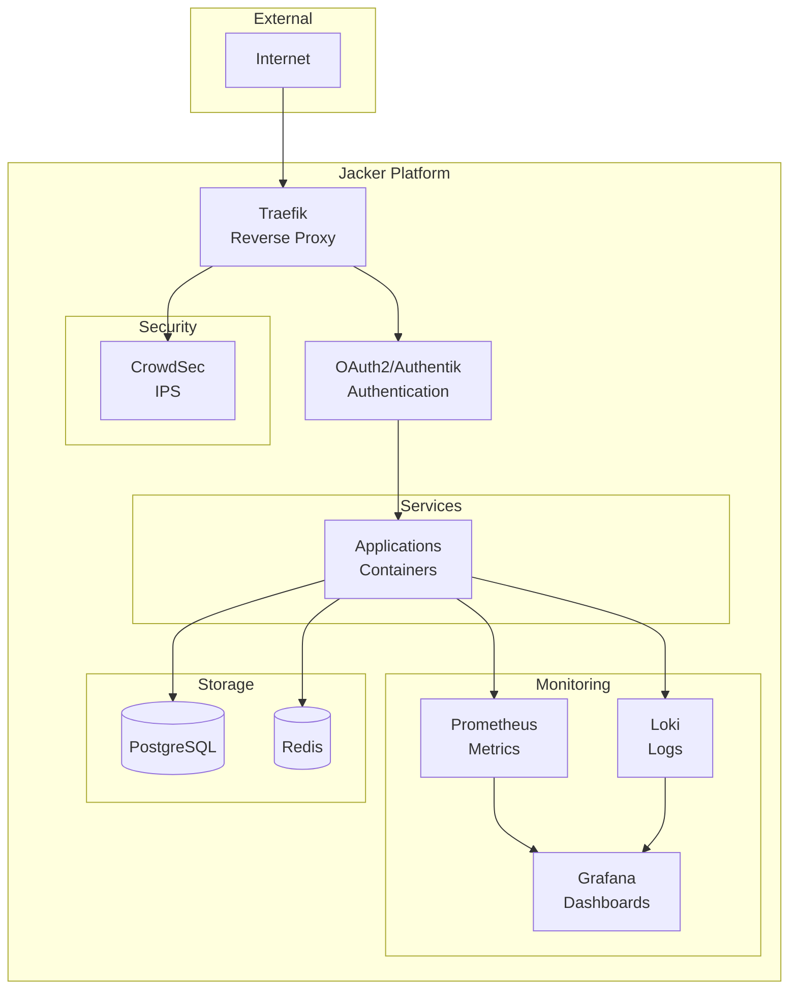

# Jacker

A production-ready Docker platform with integrated security, monitoring, and service orchestration.

## What is Jacker?

Jacker provides a complete home server management platform built on Docker, combining **Traefik v3** reverse proxy, **CrowdSec** security, **OAuth/Authentik** authentication, and comprehensive monitoring into a single, cohesive system. With 21 integrated services and modular architecture, Jacker makes self-hosting powerful applications simple and secure.

### Key Features

- 🔀 **Traefik v3** - Automatic SSL, dynamic routing, HTTP/3 support
- 🛡️ **CrowdSec IPS/IDS** - Collaborative threat protection
- 🔐 **Dual Authentication** - Google OAuth or self-hosted Authentik
- 📊 **Complete Monitoring** - Prometheus, Grafana, Loki, Promtail, Alertmanager
- 🐳 **21 Integrated Services** - Ready-to-use platform components
- 📦 **Stack Management** - Install additional applications with one command
- 🚀 **Quick Setup** - Get running in under 5 minutes
- 🔧 **Modular Architecture** - Easy to customize and extend

## Architecture



## Quick Start

```bash
# Clone the repository
git clone https://github.com/jacar-javi/jacker.git
cd jacker

# Run installer (choose Quick or Advanced setup)
./jacker init

# Check health
./jacker health

# Access your services
# https://yourdomain.com - Homepage dashboard
# https://traefik.yourdomain.com - Traefik dashboard
# https://grafana.yourdomain.com - Grafana monitoring
```

That's it! Your Jacker platform is now running with all 21 services ready to use.

### Setup Modes

**Quick Setup** (< 1 minute)
- Minimal prompts, auto-detection of system settings
- Perfect for testing or development
- Can reconfigure OAuth/SSL later with `./jacker config oauth` and `./jacker config ssl`

**Advanced Setup** (Full customization)
- Complete control over all settings
- Production-ready configuration
- OAuth credentials, SSL certificates, and advanced options

## Included Services

Jacker comes with **21 integrated services** organized into functional categories:

### Core Infrastructure
- **Traefik v3** - Reverse proxy with automatic SSL (Let's Encrypt)
- **Socket Proxy** - Secure Docker socket access
- **PostgreSQL** - Relational database for services
- **Redis** - In-memory cache for authentication sessions

### Security & Authentication
- **OAuth2** - Google OAuth authentication (default)
- **Authentik** - Self-hosted identity provider (optional, supports MFA/SSO/SAML)
- **CrowdSec** - Collaborative IPS/IDS with community threat intelligence
- **Traefik Bouncer** - Real-time IP blocking

### Monitoring & Observability
- **Prometheus** - Metrics collection and time-series database
- **Grafana** - Visualization dashboards for metrics and logs
- **Loki** - Log aggregation system
- **Promtail** - Log collection agent
- **Alertmanager** - Alert routing and notifications
- **Node Exporter** - System metrics (CPU, memory, disk, network)
- **Jaeger** - Distributed tracing for microservices

### Management Tools
- **Homepage** - Unified dashboard with auto-discovery and widgets
- **Portainer** - Web UI for Docker management
- **VS Code Server** - Browser-based IDE for remote development

📖 **Detailed service documentation:** [compose/README.md](compose/README.md)

## Additional Applications

Install additional stacks with the integrated stack manager:

```bash
# List available stacks
./jacker stacks list

# Search for specific applications
./jacker stacks search wordpress

# Install a stack
./jacker stacks install wordpress

# List installed stacks
./jacker stacks installed
```

## Documentation

Complete documentation is available at **[jacker.jacar.es](https://jacker.jacar.es)**

### 📚 Quick Links

#### Getting Started
- **[Installation Guide](https://jacker.jacar.es/installation/)** - System requirements and setup
- **[Quick Start](https://jacker.jacar.es/installation/quick-start/)** - Get running in 5 minutes
- **[Configuration](https://jacker.jacar.es/installation/configuration/)** - Environment variables and settings

#### Repository Documentation
- **[compose/README.md](compose/README.md)** - All 21 services documented with URLs, images, and descriptions
- **[assets/README.md](assets/README.md)** - All scripts, libraries, and maintenance tools
- **[config/README.md](config/README.md)** - Configuration management and templates
- **[data/README.md](data/README.md)** - Runtime data, permissions, and storage
- **[secrets/README.md](secrets/README.md)** - Secrets management and security

#### Operations
- **[User Guide](https://jacker.jacar.es/guide/)** - Daily operations and management
- **[Security](https://jacker.jacar.es/security/)** - Security features and best practices
- **[Monitoring](https://jacker.jacar.es/monitoring/)** - Metrics, logs, and alerting
- **[Troubleshooting](https://jacker.jacar.es/troubleshooting/)** - Common issues and solutions

## Management

```bash
# Basic commands
./jacker start          # Start all services
./jacker stop           # Stop all services
./jacker restart        # Restart all services
./jacker status         # Show service status
./jacker logs           # View all logs

# Updates and maintenance
./jacker update         # Update all images
./jacker backup         # Create backup
./jacker health         # Check service health

# View all available commands
./jacker help
```

## Support

- **📖 Documentation**: [jacker.jacar.es](https://jacker.jacar.es)
- **🐛 Issues**: [GitHub Issues](https://github.com/jacar-javi/jacker/issues)
- **💬 Discussions**: [GitHub Discussions](https://github.com/jacar-javi/jacker/discussions)
- **📧 Contact**: [support@jacker.jacar.es](mailto:support@jacker.jacar.es)

## Contributing

Contributions are welcome! Please see our [Contributing Guide](https://github.com/jacar-javi/jacker/blob/main/CONTRIBUTING.md) for details.

## License

This project is licensed under the terms specified in [LICENSE](LICENSE).

---

**Jacker** = **ja**car + do**cker** - Your complete Docker platform solution.
