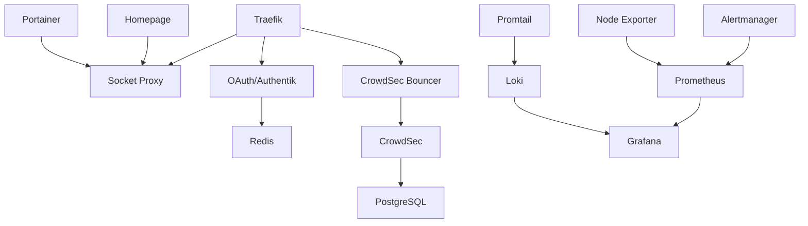

# Jacker Compose Services

This directory contains modular Docker Compose service definitions for the Jacker platform. Each service is defined in its own YAML file and included in the main `docker-compose.yml`.

## 📋 Table of Contents

- [Overview](#overview)
- [Core Infrastructure](#core-infrastructure)
- [Authentication & Security](#authentication--security)
- [Monitoring & Observability](#monitoring--observability)
- [Management Tools](#management-tools)
- [Service Dependencies](#service-dependencies)
- [Configuration Management](#configuration-management)
- [Docker Secrets](#docker-secrets)

## Overview

All services are accessible via Traefik reverse proxy at `https://<service>.$PUBLIC_FQDN` where `$PUBLIC_FQDN` is your configured domain (e.g., `myserver.example.com`).

**Total Services:** 20 compose files
**Architecture:** Modular service inclusion via `docker-compose.yml`

## Core Infrastructure

### 🔀 traefik.yml
**Reverse Proxy & Load Balancer**

- **Image:** `traefik:v3.5.5`
- **URL:** `https://traefik.$PUBLIC_FQDN`
- **Ports:** 80 (HTTP), 443 (HTTPS/TCP), 443 (HTTPS/UDP for HTTP/3)
- **Purpose:** Dynamic reverse proxy with automatic Let's Encrypt SSL certificates
- **Config:** Uses Docker configs from `config/traefik/`
- **Description:** Traefik acts as the gateway for all services in Jacker, routing external requests to the appropriate containers based on domain names. It automatically discovers new services via Docker labels, generates and renews SSL certificates through Let's Encrypt, and handles HTTP to HTTPS redirects. Traefik also provides built-in load balancing, circuit breakers, and request middleware chains for authentication. The dashboard provides real-time monitoring of routes, services, and middleware.
- **Docs:** https://doc.traefik.io/traefik/

### 🔌 socket-proxy.yml
**Docker Socket Proxy**

- **Image:** `tecnativa/docker-socket-proxy:latest`
- **Port:** 2375 (internal)
- **Purpose:** Secure proxy for Docker socket to limit Traefik's access
- **Description:** The Docker socket (`/var/run/docker.sock`) provides full control over Docker, which poses a security risk if exposed directly to containers. Socket Proxy creates a secure intermediary that only allows specific Docker API operations. It restricts Traefik and other services to read-only access for service discovery, preventing them from executing dangerous operations like container deletion or volume mounting. This follows the principle of least privilege for enhanced security.
- **Docs:** https://github.com/Tecnativa/docker-socket-proxy

### 🗄️ postgres.yml
**PostgreSQL Database**

- **Image:** `postgres:17-alpine`
- **Port:** 5432 (internal)
- **Purpose:** Database for CrowdSec and other services
- **Database:** `crowdsec_db`
- **Secrets:** Uses Docker secrets for passwords
- **Config:** Uses Docker configs from `config/postgres/`
- **Description:** PostgreSQL provides reliable, ACID-compliant relational database storage for Jacker services. It stores CrowdSec's decision engine data (blocked IPs, scenarios, alerts), user credentials for Authentik, and can be used by custom applications. The Alpine-based image keeps the footprint small while maintaining full PostgreSQL features. Automated backups and health checks ensure data integrity and availability. Includes pgBackRest for advanced backup and recovery.
- **Docs:** https://www.postgresql.org/docs/

### 🔴 redis.yml
**Redis Cache**

- **Image:** `redis:7-alpine`
- **Port:** 6379 (internal)
- **Purpose:** In-memory cache for authentication sessions
- **Secrets:** Uses Docker secrets for passwords
- **Config:** Uses Docker configs from `config/redis/`
- **Description:** Redis provides ultra-fast in-memory data storage for authentication session management. It stores OAuth tokens, user session data, and can be used for rate limiting and temporary data caching. The in-memory architecture delivers sub-millisecond response times, making authentication checks nearly instantaneous. Redis also supports persistence to disk, ensuring session data survives container restarts without users needing to re-authenticate. Includes Redis Exporter for Prometheus metrics.
- **Docs:** https://redis.io/docs/

## Authentication & Security

### 🔐 oauth.yml
**OAuth2 Authentication (Default)**

- **Image:** `quay.io/oauth2-proxy/oauth2-proxy:v7.7.1`
- **URL:** `https://auth.$PUBLIC_FQDN`
- **Purpose:** OAuth2 forward authentication for Traefik
- **Required Env:** `OAUTH_CLIENT_ID` (stored in .env)
- **Required Secrets:** `oauth_client_secret`, `oauth_cookie_secret`
- **Config:** Uses Docker configs from `config/oauth2-proxy/`
- **Description:** OAuth2 Proxy provides secure authentication using your existing Google, GitHub, or other OAuth2 providers. When users access protected services, they're redirected to the OAuth provider for login, then back to the service after verification. Access is restricted to whitelisted email addresses, making it perfect for personal or small team deployments. The forward authentication pattern means no modifications are needed to individual services - Traefik handles authentication centrally. Session tokens are cached in Redis for fast subsequent access. Now using the official oauth2-proxy for better security and feature support.
- **Docs:** https://oauth2-proxy.github.io/oauth2-proxy/

### 🔑 authentik.yml
**Authentik (Alternative Self-Hosted Auth)**

- **Image:** `ghcr.io/goauthentik/server:${AUTHENTIK_VERSION:-2024.10.4}`
- **URL:** `https://auth.${DOMAINNAME}`
- **Purpose:** Advanced self-hosted identity provider (SSO, MFA, LDAP, SAML)
- **Setup:** Run `./jacker config authentik` or `./assets/setup-authentik.sh`
- **Secrets:** Uses Docker secrets for `authentik_secret_key`, `authentik_postgres_password`
- **Description:** Authentik is a powerful, self-hosted identity provider that offers enterprise-grade features without external dependencies. It supports multiple authentication protocols (OAuth2, SAML, LDAP), multi-factor authentication (TOTP, WebAuthn, SMS), user self-service portals, and policy-based access control. Authentik can integrate with existing LDAP directories, provide SSO for dozens of applications, and offers a visual flow designer for customizing authentication workflows. Choose Authentik over OAuth when you need MFA, user management, or want complete control over authentication data.
- **Docs:** https://goauthentik.io/docs/

### 🛡️ crowdsec.yml
**CrowdSec IPS/IDS**

- **Image:** `crowdsecurity/crowdsec:v1.7.0`
- **Purpose:** Intrusion Prevention System with collaborative threat intelligence
- **Database:** Uses PostgreSQL
- **Secrets:** Uses Docker secrets for database password and API keys
- **Config:** Uses Docker configs from `config/crowdsec/`
- **Description:** CrowdSec is a modern, collaborative intrusion prevention system that protects your server from attacks. It analyzes logs from various sources (Traefik, SSH, web servers) using behavior-based scenarios to detect malicious activity like brute-force attacks, port scans, and exploitation attempts. Detected attackers are automatically blocked, and threat intelligence is shared with the CrowdSec community, creating a global protection network. CrowdSec includes pre-built scenarios for common attacks and can be extended with custom parsers and scenarios. It's like a neighborhood watch for your server.
- **Docs:** https://docs.crowdsec.net/

### 🚫 traefik-bouncer.yml
**CrowdSec Traefik Bouncer**

- **Image:** `fbonalair/traefik-crowdsec-bouncer:0.5.0`
- **Purpose:** Blocks malicious IPs detected by CrowdSec
- **Depends on:** crowdsec
- **Secrets:** Uses Docker secrets for bouncer API key
- **Description:** The Traefik Bouncer connects CrowdSec's decision engine to Traefik's middleware system, automatically blocking requests from IP addresses that CrowdSec has identified as malicious. When CrowdSec detects an attack pattern, the bouncer updates Traefik's IP whitelist in real-time, preventing further requests from the attacker. This creates an automated defense system that responds to threats without manual intervention, blocking attacks at the edge before they reach your services.
- **Docs:** https://github.com/fbonalair/traefik-crowdsec-bouncer

### 🔌 traefik-crowdsec-plugin.yml
**CrowdSec Traefik Plugin**

- **Purpose:** Alternative CrowdSec integration via Traefik plugin
- **Description:** This provides an alternative method of integrating CrowdSec with Traefik using Traefik's native plugin system instead of an external bouncer container. The plugin checks incoming requests against CrowdSec's Local API directly from within Traefik's middleware chain. Choose this over the bouncer if you prefer a more integrated solution or want to reduce the number of running containers. Both approaches provide equivalent protection.
- **Docs:** https://plugins.traefik.io/plugins/6335346ca4caa9ddeffda116/crowdsec-bouncer-traefik-plugin

## Monitoring & Observability

### 📊 prometheus.yml
**Prometheus Metrics**

- **Image:** `prom/prometheus:v3.6.0`
- **Port:** 9090 (internal)
- **Purpose:** Time-series database for metrics collection
- **Config:** Uses Docker configs from `config/prometheus/`
- **Description:** Prometheus is the industry-standard monitoring system for cloud-native applications. It scrapes metrics from configured endpoints (services, exporters) at regular intervals and stores them in its time-series database. Prometheus excels at tracking performance metrics like CPU usage, memory consumption, request rates, and response times. Its powerful PromQL query language enables complex analysis and alerting rules. Prometheus integrates seamlessly with Grafana for visualization and Alertmanager for notifications. All Jacker services expose metrics that Prometheus collects automatically. Includes cAdvisor for container metrics and Pushgateway for batch jobs.
- **Docs:** https://prometheus.io/docs/

### 📈 grafana.yml
**Grafana Dashboards**

- **Image:** `grafana/grafana-enterprise:12.2.0`
- **URL:** `https://grafana.$PUBLIC_FQDN`
- **Purpose:** Visualization and dashboards for metrics and logs
- **Default User:** `admin`
- **Secrets:** Uses Docker secrets for admin password
- **Config:** Uses Docker configs from `config/grafana/`
- **Description:** Grafana is the visualization powerhouse that transforms raw metrics and logs into beautiful, insightful dashboards. It queries data from Prometheus (metrics) and Loki (logs) to create real-time monitoring displays with graphs, tables, heatmaps, and alerts. Grafana comes with thousands of pre-built dashboards for common services, and you can create custom dashboards using a drag-and-drop interface. Features include alerting, annotations, user management, and dashboard sharing. The Enterprise edition includes all OSS features plus additional authentication options. It's your single pane of glass for system observability.
- **Docs:** https://grafana.com/docs/grafana/

### 📝 loki.yml
**Loki Log Aggregation**

- **Image:** `grafana/loki:3.5.5`
- **Port:** 3100 (internal)
- **Purpose:** Log aggregation system (like Prometheus for logs)
- **Config:** Uses Docker configs from `config/loki/`
- **Description:** Loki is Grafana's log aggregation system, designed to be cost-effective and easy to operate. Unlike traditional log systems that index log content, Loki only indexes metadata (labels), making it incredibly efficient. It receives logs from Promtail, stores them compressed, and provides a powerful query language (LogQL) for searching and filtering. Loki integrates directly with Grafana, allowing you to correlate logs with metrics on the same dashboard. Perfect for troubleshooting issues by viewing application and system logs in real-time.
- **Docs:** https://grafana.com/docs/loki/

### 📤 promtail.yml
**Promtail Log Shipper**

- **Image:** `grafana/promtail:3.5.5`
- **Purpose:** Collects and ships Docker logs to Loki
- **Config:** Uses Docker configs from `config/loki/`
- **Description:** Promtail is the log shipping agent that tails Docker container logs and sends them to Loki. It runs on each server, automatically discovering containers and reading their stdout/stderr logs. Promtail enriches logs with labels (container name, service, host) for easy filtering and adds metadata before forwarding to Loki. The configuration controls which logs to collect, how to parse them, and what labels to attach. Promtail is lightweight and designed to have minimal performance impact.
- **Docs:** https://grafana.com/docs/loki/latest/send-data/promtail/

### 🔔 alertmanager.yml
**Alertmanager**

- **Image:** `prom/alertmanager:v0.28.1`
- **Port:** 9093 (internal)
- **Purpose:** Alert routing and notification management
- **Config:** Uses Docker configs from `config/alertmanager/`
- **Secrets:** Can use Docker secrets for notification credentials
- **Description:** Alertmanager handles alerts generated by Prometheus, providing deduplication, grouping, and routing to notification channels. When Prometheus detects a problem (high CPU, disk full, service down), it sends an alert to Alertmanager, which then notifies you via email, Slack, PagerDuty, or other integrations. Alertmanager prevents alert fatigue by grouping similar alerts, silencing alerts during maintenance windows, and managing alert escalation. It ensures you're notified about critical issues without being overwhelmed by noise.
- **Docs:** https://prometheus.io/docs/alerting/latest/alertmanager/

### 💻 node-exporter.yml
**Node Exporter**

- **Image:** `prom/node-exporter:v1.9.1`
- **Port:** 9100 (internal)
- **Purpose:** System metrics exporter (CPU, memory, disk, network)
- **Description:** Node Exporter is a Prometheus exporter for hardware and OS-level metrics from Linux systems. It exposes hundreds of metrics including CPU usage, memory utilization, disk I/O, network statistics, filesystem usage, and system load. Node Exporter runs with minimal overhead and provides the foundation for infrastructure monitoring. These metrics feed into Prometheus and appear in Grafana dashboards, giving you complete visibility into your server's health and performance. Essential for detecting resource exhaustion and capacity planning.
- **Docs:** https://github.com/prometheus/node_exporter

### 🔍 jaeger.yml
**Jaeger Tracing**

- **Image:** `jaegertracing/all-in-one:1.62`
- **URL:** `https://jaeger.$PUBLIC_FQDN`
- **Ports:** 16686 (UI), 14268 (collector)
- **Purpose:** Distributed tracing for microservices
- **Description:** Jaeger provides distributed tracing to track requests as they flow through multiple services, helping identify bottlenecks and debug complex interactions. When a request enters your system, Jaeger tracks its path, timing, and metadata across all services it touches, creating a complete trace. The UI visualizes these traces, showing you exactly where time is spent and where errors occur. While less critical for single-server setups, Jaeger becomes invaluable when running multiple interconnected services, enabling you to optimize performance and troubleshoot issues that span service boundaries.
- **Docs:** https://www.jaegertracing.io/docs/

## Management Tools

### 🏠 homepage.yml
**Homepage Dashboard**

- **Image:** `ghcr.io/gethomepage/homepage:v1.5.0`
- **URL:** `https://$PUBLIC_FQDN` (root domain)
- **Purpose:** Customizable homepage with service links and widgets
- **Auto-Discovery:** Reads Docker labels for automatic service addition
- **Description:** Homepage serves as your unified dashboard and landing page for all Jacker services. It automatically discovers services through Docker labels and displays them in organized groups with live status widgets showing real-time metrics (CPU, memory, request counts). Homepage supports integration widgets for dozens of popular services, displaying relevant information like Traefik routes, Portainer container counts, or Grafana dashboard links. Fully customizable with themes, bookmarks, and custom widgets. It's your command center that makes accessing and monitoring all services effortless.
- **Docs:** https://gethomepage.dev/

### 🐳 portainer.yml
**Portainer Container Management**

- **Image:** `portainer/portainer-ce:2.33.1`
- **URL:** `https://portainer.$PUBLIC_FQDN`
- **Purpose:** Web UI for Docker container, image, and volume management
- **Edition:** Community Edition (CE)
- **Secrets:** Uses Docker secrets for agent secret
- **Description:** Portainer provides a comprehensive web interface for managing Docker environments without needing command-line access. Through its intuitive UI, you can start/stop/restart containers, view logs, access container consoles, manage images and volumes, edit container configurations, and deploy new stacks. Portainer also offers monitoring dashboards showing resource usage, network statistics, and container health. Perfect for users who prefer graphical interfaces or need to grant Docker management access to team members without shell access. The Community Edition includes all essential Docker management features.
- **Docs:** https://docs.portainer.io/

### 💻 vscode.yml
**VS Code Server**

- **Image:** `lscr.io/linuxserver/code-server:latest`
- **URL:** `https://code.$PUBLIC_FQDN`
- **Purpose:** Browser-based VS Code IDE for remote development
- **Password:** Configured via environment variable
- **Description:** VS Code Server brings the full Visual Studio Code experience to your browser, enabling remote development from any device. Access your complete development environment - including extensions, themes, settings, and terminal - through a web interface. Edit configuration files, develop applications, run scripts, and manage your server without SSH or local IDE setup. Code Server includes integrated terminal access, git integration, and supports most VS Code extensions. Perfect for editing Jacker configurations, developing custom applications, or managing your server from tablets and Chromebooks.
- **Docs:** https://github.com/coder/code-server

## Service Dependencies



### Critical Dependencies

1. **Socket Proxy** - Must start before Traefik, Portainer, Homepage
2. **PostgreSQL** - Required by CrowdSec (and optionally Authentik)
3. **Redis** - Required by OAuth for session storage
4. **CrowdSec** - Required by Traefik Bouncer
5. **Loki** - Required by Promtail for log ingestion

## Configuration Management

### Directory Structure

```
jacker/
├── config/               # Configuration files (Docker configs)
│   ├── traefik/         # Traefik configuration
│   ├── prometheus/      # Prometheus configuration
│   ├── loki/           # Loki and Promtail configs
│   ├── grafana/        # Grafana provisioning
│   ├── alertmanager/   # Alertmanager config
│   ├── crowdsec/       # CrowdSec configuration
│   ├── postgres/       # PostgreSQL configuration
│   ├── redis/          # Redis configuration
│   └── oauth2-proxy/   # OAuth proxy configuration
├── data/                # Runtime data only
│   └── [service]/      # Persistent volumes
└── secrets/            # Docker secrets (gitignored)
    ├── oauth_client_secret
    ├── postgres_password
    └── ...
```

### Docker Configs

Services use Docker configs for immutable configuration management:

```yaml
configs:
  traefik_yml:
    file: ${CONFIGDIR}/traefik/traefik.yml
  # ... more configs
```

Benefits:
- Configuration versioning
- Atomic updates
- Separation from runtime data
- Better security (read-only mounts)

## Docker Secrets

Sensitive data is managed through Docker secrets for enhanced security:

### Available Secrets

| Secret                        | Used By              | Purpose                                |
| ----------------------------- | -------------------- | -------------------------------------- |
| `oauth_client_secret`         | OAuth2 Proxy         | OAuth provider client secret           |
| `oauth_cookie_secret`         | OAuth2 Proxy         | Cookie encryption key                  |
| `postgres_password`           | PostgreSQL, CrowdSec | Database password                      |
| `redis_password`              | Redis                | Cache password                         |
| `crowdsec_lapi_key`           | CrowdSec             | Local API key                          |
| `crowdsec_bouncer_key`        | Traefik Bouncer      | Bouncer API key                        |
| `grafana_admin_password`      | Grafana              | Admin user password                    |
| `alertmanager_gmail_password` | Alertmanager         | Gmail app password (optional)          |
| `authentik_secret_key`        | Authentik            | Secret key (if using Authentik)        |
| `authentik_postgres_password` | Authentik            | Database password (if using Authentik) |
| `portainer_secret`            | Portainer            | Agent secret                           |

### Managing Secrets

```bash
# Generate missing secrets
./jacker secrets generate

# Verify all secrets exist
./jacker secrets verify

# Rotate secrets
./jacker secrets rotate
```

Secrets are stored in `${SECRETSDIR}/` with restrictive permissions (600).

## Environment Variables

Non-sensitive configuration via `.env`:

| Variable            | Used By          | Purpose                                       |
| ------------------- | ---------------- | --------------------------------------------- |
| `PUBLIC_FQDN`       | All web services | Full domain name (e.g., `server.example.com`) |
| `DOMAINNAME`        | Authentik, OAuth | Base domain name                              |
| `LETSENCRYPT_EMAIL` | Traefik          | SSL certificate notifications                 |
| `OAUTH_CLIENT_ID`   | OAuth            | OAuth provider client ID                      |
| `OAUTH_WHITELIST`   | OAuth            | Comma-separated allowed emails                |
| `POSTGRES_DB`       | PostgreSQL       | Database name                                 |
| `POSTGRES_USER`     | PostgreSQL       | Database user                                 |
| `TZ`                | All services     | Timezone (e.g., `America/New_York`)           |
| `DATADIR`           | All services     | Data directory path                           |
| `DOCKERDIR`         | All services     | Jacker installation directory                 |

Note: Passwords and secrets are now managed via Docker secrets, not environment variables.

## Networking

All services use one or more of these networks:

- **traefik_proxy** - Main network for web-accessible services
- **socket_proxy** - Isolated network for Docker socket access
- **database** - Database network for PostgreSQL connections
- **cache** - Cache network for Redis connections
- **monitoring** - Internal network for monitoring stack
- **backup** - Backup network for backup tools
- **default** - Default Docker Compose network

## Ports Exposed

Only these ports are exposed to the host:

- **80** (Traefik) - HTTP (redirects to HTTPS)
- **443 TCP** (Traefik) - HTTPS
- **443 UDP** (Traefik) - HTTP/3 (QUIC)

All other services are accessed via Traefik reverse proxy.

## Adding New Services

To add a new service:

1. Create `compose/<service-name>.yml`
2. Add Traefik labels for routing:
   ```yaml
   labels:
     - "traefik.enable=true"
     - "traefik.http.routers.<service>.rule=Host(`<service>.$${PUBLIC_FQDN}`)"
     - "traefik.http.routers.<service>.entrypoints=websecure"
     - "traefik.http.routers.<service>.middlewares=chain-oauth@file"
   ```
3. Add to `docker-compose.yml`:
   ```yaml
   include:
     - path: compose/<service-name>.yml
   ```
4. Add homepage integration (optional):
   ```yaml
   labels:
     - "homepage.group=<category>"
     - "homepage.name=<Service Name>"
     - "homepage.icon=<icon>.svg"
     - "homepage.href=https://<service>.$${PUBLIC_FQDN}"
   ```
5. If service needs configuration:
   - Add configs to `config/<service>/`
   - Define in docker-compose.yml configs section
6. If service needs secrets:
   - Add to docker-compose.yml secrets section
   - Generate with `./jacker secrets generate`

## Related Documentation

- [Main README](../README.md) - Project overview
- [Assets README](../assets/README.md) - Scripts and tools documentation
- [Config README](../config/README.md) - Configuration management
- [Data README](../data/README.md) - Runtime data documentation
- [Secrets README](../secrets/README.md) - Secrets management

## Support & Resources

- **Traefik Docs:** https://doc.traefik.io/traefik/
- **Docker Compose Docs:** https://docs.docker.com/compose/
- **Jacker Issues:** https://github.com/jacar-javi/jacker/issues

---

**Last Updated:** 2025-10-12
**Jacker Version:** 3.0.0 (Unified CLI with Docker Secrets)
